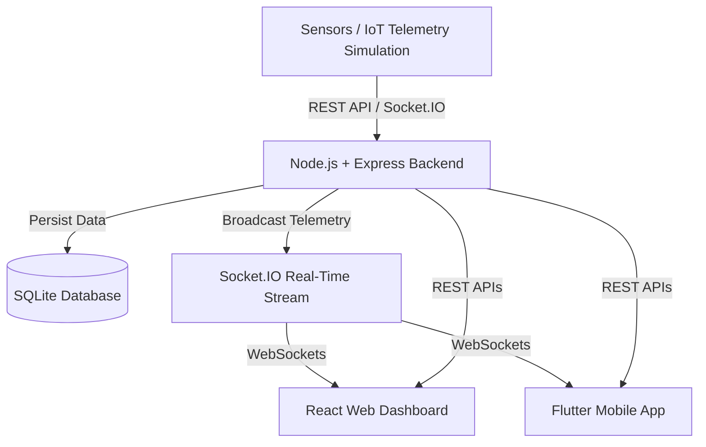

# VitalsSync – Real-Time Healthcare Monitoring System

[](LICENSE)
[](frontend/)
[](backend/)
[](backend/)
[](backend/)
[](backend/)
[](mobile/)

---

## 📌 Project Overview

**VitalsSync** is an end-to-end, real-time healthcare monitoring platform built for medical professionals (doctors), caretakers, and patients. It provides continuous vital signs tracking, automated threshold-based medical risk alerts, analytical trend reports, and real-time telemetry streaming across both a modern **React Web Dashboard** and a cross-platform **Flutter Mobile Application**.

---

## ❓ Problem Statement

In modern clinical environments, traditional intermittent vital sign checks can lead to delayed detection of sudden patient deterioration. Continuous patient monitoring generates continuous telemetry data, but hospital staff often lack unified, low-latency tools to monitor multiple patients remotely. Critical abnormal conditions—such as sudden drops in blood oxygen levels ($\text{SpO}_2$) or severe hypertension spikes—require immediate, automated alert mechanisms accessible anywhere on desktop or mobile.

---

## 💡 Proposed Solution

**VitalsSync** addresses these critical clinical challenges through an integrated real-time monitoring and alerting ecosystem:

- 📊 **Real-Time Vital Monitoring**: Continuous live stream of key physiological parameters.
- ❤️ **Heart Rate (BPM) Monitoring**: Real-time pulse monitoring with abnormal tachycardia/bradycardia alerts.
- 🫁 **$\text{SpO}_2$ (Oxygen Saturation) Tracking**: Instant hypoxemia detection (<92%).
- 🩸 **Blood Pressure Monitoring**: Systolic and Diastolic pressure tracking with hypertensive crisis warnings.
- 🌡️ **Body Temperature Monitoring**: Continuous fever and hypothermia detection.
- 💯 **Composite Health Score**: Dynamic algorithm calculating overall patient status (0–100%).
- 🚨 **Multi-Tier Alert System**: Instant visual and audio notifications (CRITICAL, WARNING, INFO, RESOLVED).
- 👨‍⚕️ **Doctor Dashboard**: Unified view of all assigned patients, quick filters, telemetry graphs, and clinical actions.
- 🤝 **Caretaker Dashboard**: Focus on assigned ward patients, quick emergency contact, and status tracking.
- 🩺 **Patient Dashboard**: Simplified personal health overview, personal trend graphs, and history.
- 📈 **Clinical Reports & Analytics**: 24-Hour, 3-Day, and 7-Day vital trend analysis with data tables.
- 📄 **Export Options**: One-click CSV export and browser PDF printing for medical archives.
- 🔒 **Role-Based Access Control (RBAC)**: Enforced JWT security restricting actions based on user roles.
- ⚡ **Socket.IO Telemetry Stream**: Ultra-low-latency real-time data sync across all web and mobile clients.

---

## ✨ Key Features

- **Cross-Platform Support**: Seamless operation on Desktop Browsers, Android, and iOS devices.
- **Dark Glassmorphism UI**: High-contrast, clinical dark mode designed to minimize eye strain in medical environments.
- **Interactive Sensor Charts**: High-frequency charts built with Chart.js (Web) and FL Chart (Mobile).
- **Non-Blocking Floating Alerts**: Subdued top-right alert toasts that never obstruct core navigation or patient details.
- **Historical Data Inspection**: Detailed tabular patient telemetry logs with formatted timestamps (e.g., `06 Sep, 10:30 AM`).

---

## 🏗️ System Architecture



### Data Flow Overview

1. **Sensors / IoT Stream**: Patient physiological sensors send vitals data to the backend via HTTP API endpoints or Socket.IO events.
2. **Backend / REST API**: Node.js & Express validate inputs, calculate composite health scores, check alert thresholds, and emit Socket.IO events.
3. **SQLite Database**: Lightweight, zero-config relational database storing user accounts, patient records, telemetry logs, and system alerts.
4. **Socket.IO Stream**: Real-time WebSocket engine broadcasting live vital updates and emergency alerts to connected clients.
5. **Web & Mobile Applications**: React Web Dashboard and Flutter Mobile App receive live updates and render responsive UI elements synchronously.

---

## 👥 User Roles & Responsibilities

| Role | Permissions & Actions |
| :--- | :--- |
| **Doctor** | • View all active patients and ward telemetry<br>• Access 7-day analytics and clinical reports<br>• Manage medical staff and update patient details<br>• Trigger and resolve emergency alerts |
| **Caretaker** | • View assigned patients and live vital streams<br>• Receive instant emergency notifications<br>• Execute emergency contact actions<br>• Monitor real-time status changes |
| **Patient** | • Access personal health dashboard and history<br>• View personal heart rate, $\text{SpO}_2$, BP, and temperature graphs<br>• Track overall health score and personal warnings |

---

## 🛠️ Technology Stack

### **Frontend (Web Dashboard)**
- **Framework**: React 18 (Vite)
- **Styling**: Vanilla CSS3 (Custom Design System with Dark Glassmorphism)
- **Charts**: Chart.js & React-Chartjs-2
- **Icons**: Lucide React
- **Real-Time Client**: Socket.IO Client

### **Backend (REST & Real-Time Engine)**
- **Runtime**: Node.js (v18+)
- **Framework**: Express.js
- **Database**: SQLite3 (`sqlite3` / `sqlite` promise wrapper)
- **Authentication**: JSON Web Tokens (JWT) & bcryptjs password hashing
- **Real-Time Engine**: Socket.IO Server

### **Mobile (Cross-Platform App)**
- **Framework**: Flutter 3 (Dart)
- **State Management**: Provider
- **Charts**: FL Chart (`fl_chart`)
- **Networking**: `http` & `socket_io_client`
- **UI Components**: Google Fonts (`Inter`), Custom Dark Glassmorphic Widgets

---

## 🌐 Website Routes

| Route | Access Level | Description |
| :--- | :--- | :--- |
| `/login` | Public | Authentication page for Doctors, Caretakers, and Patients |
| `/doctor` | Protected (`doctor`) | Master Doctor Dashboard with patient grids and filters |
| `/caretaker` | Protected (`caretaker`) | Caretaker Dashboard focusing on assigned ward patients |
| `/patient-dashboard` | Protected (`patient`) | Individual Patient portal for personal health metrics |
| `/patient/:id` | Protected (`doctor`, `caretaker`) | Deep-dive patient telemetry details, graphs, and logs |
| `/staff-management` | Protected (`doctor`) | Medical staff directory, role assignments, and status |
| `/reports` | Protected (`doctor`, `caretaker`) | 24h, 3-day, 7-day analytical reports & CSV/PDF export |

---

## ⚡ Real-Time Monitoring & Alerts

### **Real-Time Telemetry Stream**
VitalsSync utilizes WebSockets via Socket.IO to stream telemetry every few seconds. Live metrics include:
- **Heart Rate**: Normal range 60–100 BPM
- **$\text{SpO}_2$**: Normal range 95–100%
- **Blood Pressure**: Normal Systolic 90–120 mmHg, Diastolic 60–80 mmHg
- **Body Temperature**: Normal range 36.5–37.5 °C (97.7–99.5 °F)

### **Threshold & Alert Matrix**
When incoming vitals cross safety thresholds, the backend generates system alerts:

| Severity | Condition Example | Visual Indicator | Sound/Behavior |
| :--- | :--- | :--- | :--- |
| 🔴 **CRITICAL** | $\text{SpO}_2 < 90\%$ OR Heart Rate $> 130$ BPM | Red Accent / Toast | High priority, audio ping, toast notification |
| 🟡 **WARNING** | Temperature $> 38.0^\circ\text{C}$ OR Systolic $> 140$ | Amber Accent / Toast | Medium priority, warning toast |
| 🔵 **INFO** | Patient assigned / routine check | Blue Accent / Toast | Low priority, informative toast |
| 🟢 **RESOLVED** | Vitals stabilized to normal range | Green Accent / Toast | System status normalized |

---

## 🔒 Security Architecture

- **Authentication**: JWT tokens issued upon successful login, stored securely in `localStorage` (Web) or `SharedPreferences` (Mobile).
- **Role-Based Access Control (RBAC)**: Backend middleware validates user roles (`doctor`, `caretaker`, `patient`) before responding to REST endpoints.
- **Protected Frontend Routes**: Client-side navigation guards automatically redirect unauthenticated users to `/login`.
- **Input Validation**: Strict sanitization of user credentials, patient IDs, and vital inputs.
- **Secure Password Storage**: Passwords stored using industry-standard bcrypt hashing.

---

## 📁 Project Folder Structure

```text
vitalsync/
├── backend/                  # Node.js Express Backend
│   ├── db/                   # Database scripts & SQLite file
│   ├── middleware/           # Auth & RBAC middleware
│   ├── routes/               # REST API route handlers
│   ├── utils/                # Health score calculation & helpers
│   ├── server.js             # Main server entrypoint
│   └── package.json
│
├── frontend/                 # React Web Application
│   ├── src/
│   │   ├── components/       # Reusable UI (PatientCard, SensorGraph, AlertToast)
│   │   ├── context/          # React Context (AuthContext, SocketContext)
│   │   ├── pages/            # Page Views (Login, Doctor, Caretaker, Patient, Reports)
│   │   ├── App.jsx           # Application Router & Layout
│   │   └── index.css         # Core Design Tokens & Glassmorphism CSS
│   ├── index.html
│   ├── vite.config.js
│   └── package.json
│
├── mobile/                   # Flutter Mobile Application
│   ├── lib/
│   │   ├── core/             # Theme, Constants, Api Constants
│   │   ├── models/           # Dart Data Models (User, Patient, Vital, Alert)
│   │   ├── providers/        # State Management (Auth, Patient, Telemetry)
│   │   ├── routes/           # Named Flutter Routes
│   │   ├── screens/          # Login, Doctor, Caretaker, Patient, Reports Screens
│   │   ├── services/         # API Service, Auth Service, Socket Service
│   │   ├── widgets/          # Custom Glassmorphic Cards, Toast, Graphs
│   │   └── main.dart         # Flutter Main Entrypoint
│   └── pubspec.yaml
│
├── docs/                     # Technical Documentation
│   ├── architecture.md       # System Design & Data Flow
│   ├── api.md                # Complete REST & Socket.IO API Reference
│   ├── web-app.md            # React Web Application Guide
│   ├── mobile-app.md         # Flutter Mobile Application Guide
│   └── setup.md              # Installation & Local Setup Guide
│
├── .gitignore                # Git Exclusion Rules
├── .env.example              # Shared Environment Configuration Template
├── LICENSE                   # MIT License
└── README.md                 # Master Project README
```

---

## 🚀 Quick Setup & Installation

For full installation details, refer to the [Setup Guide](docs/setup.md).

### **1. Clone the Repository**
```bash
git clone https://github.com/D-prasad10/vitalsync.git
cd vitalsync
```

### **2. Setup Environment Variables**
Copy `.env.example` to `.env` in both `backend/` and `frontend/`:
```bash
cp .env.example backend/.env
cp .env.example frontend/.env
```

### **3. Start Backend Server**
```bash
cd backend
npm install
npm run dev
# Server running at http://localhost:5001
```

### **4. Start React Web Dashboard**
```bash
cd ../frontend
npm install
npm run dev
# Dashboard running at http://localhost:5173
```

### **5. Start Flutter Mobile App**
```bash
cd ../mobile
flutter pub get
flutter run -d chrome   # Or select iOS simulator / Android emulator
```

---

## 🔐 Environment Variables

> **Note**: Never commit actual secrets or production credentials to source control.

| Service | Variable Name | Default Value | Description |
| :--- | :--- | :--- | :--- |
| **Backend** | `PORT` | `5001` | Express server port |
| **Backend** | `JWT_SECRET` | `vitalsync_jwt_secret_key` | Secret key for JWT signing |
| **Backend** | `NODE_ENV` | `development` | Node execution environment |
| **Frontend** | `VITE_API_URL` | `http://localhost:5001` | Backend HTTP API base URL |
| **Frontend** | `VITE_SOCKET_URL` | `http://localhost:5001` | Socket.IO server base URL |

---

## 🔌 API Overview

### **Authentication Endpoints**
- `POST /api/auth/login` - Authenticate user & receive JWT token
- `GET /api/auth/me` - Fetch current authenticated user session profile

### **Patient Management Endpoints**
- `GET /api/patients` - List all patients (Filtered by role permissions)
- `GET /api/patients/:id` - Fetch single patient details & latest vitals
- `GET /api/patients/:id/telemetry` - Fetch historical telemetry data logs
- `GET /api/patients/:id/reports?period=7d` - Fetch 7-day clinical analytics report

### **Alert & Staff Endpoints**
- `GET /api/alerts` - List active patient emergency alerts
- `POST /api/alerts/:id/resolve` - Mark an active alert as resolved
- `GET /api/staff` - Retrieve list of medical staff and nurses

---

## 🖼️ Application Screenshots

| Doctor Dashboard (Web) | Patient Dashboard (Mobile) |
| :---: | :---: |
|  |  |

| Reports & Analytics | Caretaker Ward View |
| :---: | :---: |
|  |  |

---

## 🔮 Future Improvements

- 🤖 **Predictive AI Risk Modeling**: Machine learning algorithms predicting cardiac events before threshold breach.
- ⌚ **Wearable Integration**: Native Bluetooth Low Energy (BLE) integration for Apple Watch & WearOS.
- 🔔 **Push Notifications**: Firebase Cloud Messaging (FCM) integration for background mobile alerts.
- 🌐 **Multi-Hospital Telemetry Routing**: Multi-tenant architecture for enterprise healthcare networks.

---

## 🤝 Contributors

- **Durga Prasad Behera** ([@D-prasad10](https://github.com/D-prasad10)) - Lead Architect & Full-Stack Developer

---

## 📜 License

This project is licensed under the [MIT License](LICENSE) - see the LICENSE file for details.
